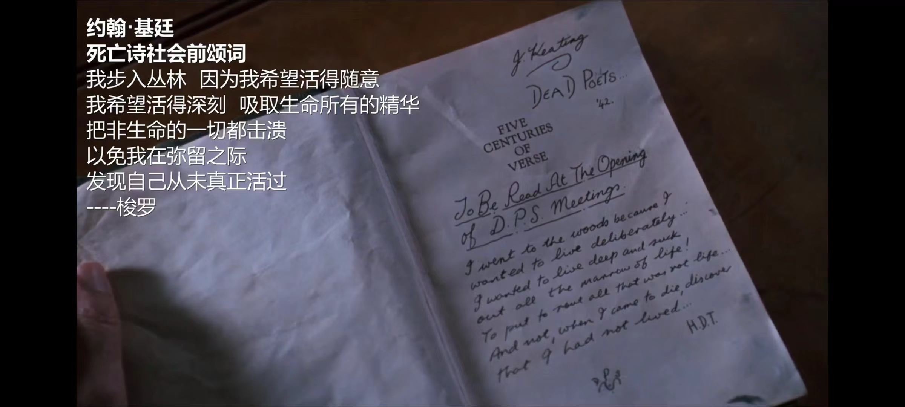

# 死亡诗社

## 简介
  威尔顿贵族学校1959年度开学典礼暨建校100周年华诞正隆重举行。校长诺伦博士骄傲地回顾着学校的辉煌，为学校一百年来始终坚持传统、荣誉、纪律和卓越四大信条并因此成为美国最好大学预备学校而骄傲。也就在这一天，威尔顿的荣誉毕业生、从伦敦回来执教的新教师约翰·基廷回校出任英文教师。

新学期开始了。沉闷的氛围、陈腐的说教，让威尔顿的大男孩们倍感压抑，同学们私下里咒骂威尔顿是地狱学校，篡改威尔顿四大信条以示嘲弄。此时，同学们怎么也不会想到，新来的基廷老师和他们心中原始的渴望一样，与众不同离经叛道的上课方式，立刻在同学们中掀起波澜。基廷哼着的《扬基进行曲》、及时行乐的信条、撕去教科书上伊凡斯·普利查矫作的诗歌分析，在威尔顿学生长期被窒息的心灵中引发了一场地震。不久，尼尔在学校图书馆里意外发现了一本刊登着基廷简历的威尔顿年鉴。原来基廷曾是足球球队的队长，参加过一个名叫“死亡诗社”的组织。
何谓“死亡诗社”，基廷给同学们讲述了诗社的秘密。在尼尔同学的倡导下，“死亡诗社”得以重建，查理、纳克斯、米克、卡麦隆等同学热烈响应，怯懦的托德也加入进来。从此，“死亡诗社”的成员们在当年基廷聚会的地方和着优美的诗句，扭动起节奏强烈的非洲原始舞蹈，释放着青春生命的激情。威尔顿学校发生着悄然的变化，麻烦和不幸在这悄然的变化中也随之而来。尼尔参加《仲夏夜之梦》演出遭到父亲的极力阻拦；纳克斯暗恋上名花有主的克莉丝姑娘；“死亡诗社”发表主张招收女生的文章。一切的一切引起诺伦校长的注意。《仲夏夜之梦》演出结束的那天晚上，尼尔用父亲的手枪让自己的灵魂飘向了遥远的天国。

尼尔的死震惊了威尔顿。校方迫于舆论压力，开始调查尼尔自杀的原因。调查结果表明，基廷对于威尔顿开学所发生的事情负完全责任。又是一堂英语课。同学们在诺伦的引导下朗读着伊凡斯·普利查的“鬼话”文章时，基廷前来告别。同学们以站上课桌大声朗读诗歌的庄重形式，目送着脸上荡漾着微笑离开教室的基廷
## 会前颂词
  我步入丛林 因为我希望活的随意
我希望活得深刻 吸取生命所有的精华
把非生命的一切都击溃
以免我在弥留之际
发现自己从未真正活过
————梭罗
    

## 人物介绍

约翰·基丁（Keating）：电影《死亡诗社》男主角，由罗宾·威廉姆斯饰演。他是威尔顿预科学院新学期来校的新文学老师，教授古典文学，用独特的教学方式激发学生对生活的热爱和对自我的思考，是学生的灵魂拯救者。

尼尔·培瑞：由罗伯特·肖恩·莱纳德饰演。他是第一个称基廷为"Captain"的学生，带头重组了"死亡诗社"，是一个充满激情的理想主义者，但最终因现实与理想的冲突而选择离开这个世界。托德·安德森：由伊桑·霍克饰演。原本是个胆怯、缺乏自信的少年，在基廷的鼓舞下逐渐敢于表达自己，最终在诗歌中找到了自我价值。

此外，《死亡诗社》中还有其他重要角色，如查理·多尔顿，由盖尔·汉森饰演，是一个热血、叛逆的青年；诺克斯，由乔西·查尔斯饰演，性格勇敢；还有史蒂文·米克斯、诺兰等角色，共同构成了这部电影的丰富人物群像。    

## 观后感
  在《死亡诗社》这部影片中，我深深地被主角基廷的形象所打动。他是一位坚守自己的信念，不畏权威，以自由和独立思考为荣的老师。透过他的形象，影片向我们展示了追求真理和自由的重要性。

  影片中的情节安排紧凑，情感表达真实，让我在观影的过程中数次被深深感动。其中最让我印象深刻的一幕是基廷在教室里对学生们说：“我们读诗、写诗并不是因为它们好玩，而是因为我们是人类的一分子，而人类是充满激情的。”这一幕让我深深地感受到了诗的力量和人类的情感。
  在这部影片中，我也看到了年轻人的觉醒和追求自由的精神。虽然这个过程是痛苦和困难的，但他们始终坚守着自己的信念。这让我深受启发，让我更加明白了追求自我和坚持信念的重要性。

  总的来说，《死亡诗社》是一部感人至深的影片。它通过一个又一个生动的情节，让我们了解了人类的情感、信念和自由的价值。这部影片不仅让我享受了观影的乐趣，更让我在思想上得到了深刻的启发。
