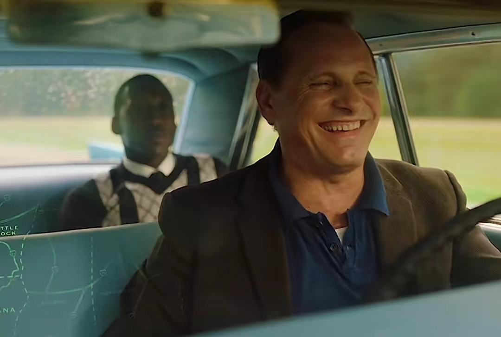

# 绿皮书

## 简介
  托尼（维果·莫特森 饰）就职的夜总会关门装修，亟需一份工作。有个朋友建议他去参加一位音乐博士为了寻找司机所举办的面试。当他到达豪华公寓后，发现这位博士是个名叫唐·谢利（马赫沙拉·阿里 饰）的黑人古典乐钢琴家，钢琴家正需要一个司机，负责在他举办南方巡演时的接送工作。当然，两人心里都十分清楚，在二十世纪六十年代种族隔离严重的南部地区，他们很容易身陷麻烦之中，但托尼需要钱，而唐需要一个能照顾他的专业司机。给托尼付钱的唱片公司给了他一本“绿皮书”指南，上面列着当地黑人可以吃饭睡觉的地方，因为很多旅馆和餐厅都是只限白人。
## 人物介绍
   《绿皮书》是一部以1960年代美国南部为背景的剧情片，讲述了两位主角的南巡故事。托尼·利普是其中的一位主角，由维果·莫特森饰演。托尼是一名纽约夜总会的保镖，同时也是一个种族歧视者，不善于言谈且世俗，但内心深处热爱家庭，有一个漂亮的妻子和两个年幼的儿子。

  在电影中，托尼与唐·雪利博士（由马赫沙拉·阿里饰演）结成了深厚的友谊。唐是一位受过高等教育的古典乐钢琴家，他虽然被上层白人欢迎，却从未真正得到平等对待，同时也与自己的族群有着较大差距。托尼在南巡过程中逐渐理解和支持唐，两人之间的关系也逐渐改善。

  电影《绿皮书》中的托尼·利普这个角色是根据真实人物托尼·利普的原型所创作的，托尼·利普原名Frank Anthony Vallelonga，是一位意大利裔美国保镖和夜总会舞者。在现实中，他在科帕卡巴纳夜总会工作之前，曾在美国军队服役，并在20世纪50年代初驻扎在战后的德国。托尼·利普的故事展示了他在种族歧视和社会压力下的挣扎和寻找自我认同的过程。
  
## 观后感
   《绿皮书》是一部感人至深的电影，讲述了一段不凡的旅程和一段深厚的友谊。电影的背景设定在1960年代的美国，当时的美国南部还是一个种族隔离严重的地区。而这个故事的主角，就是一位黑人钢琴家和他的白人司机，以及他们在这段旅程中建立的深厚友谊。

  这部电影的情节细腻入微，刻画了黑白之间的矛盾和差异，同时也揭示了人性的善良和美好。黑人钢琴家唐雪莉是一个有才华、有思想的人，他为了自由和正义而不断努力。而白人司机托尼则是一个典型的纽约佬，他在这个旅程中逐渐学会了尊重和接纳不同的人种。
  在这段旅程中，唐雪莉和托尼的友谊逐渐加深，他们相互关心、相互扶持，彼此之间的隔阂也逐渐消散。电影中最感人的部分是唐雪莉在遭受种族歧视后，托尼愤怒地为他挺身而出，最终两人携手走向自由和正义。
  除了情节的感人之处，这部电影的制作也十分精良。演员们的表演非常自然、真实，让人感受到了角色的内心世界。配乐也非常优美，与电影的情节相得益彰。电影中的场景、服装和道具也还原了当时的历史背景和文化氛围。

  总的来说，《绿皮书》是一部非常值得一看的电影。它不仅揭示了黑白之间的矛盾和差异，更展示了人性的善良和美好。这部电影将让你笑中带泪，感动至深。